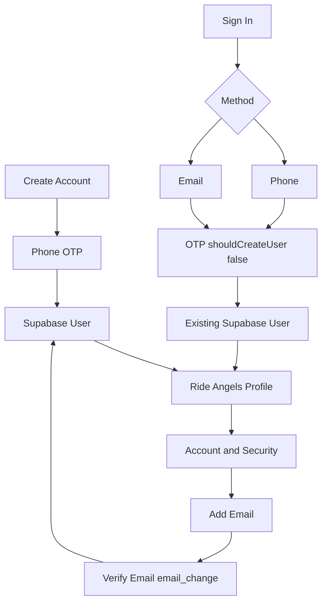

# Authentication

Ride Angels uses **Supabase Auth** (passwordless OTP only) with a strict
**one account / multiple sign-in methods** model.

Installed client: `@supabase/supabase-js@2.112.2`

---

## 1. Architecture



Three separate concepts:

1. **Supabase Auth User** — canonical identity (`user.id` UUID)
2. **Authentication methods** — verified phone / email (later Apple, Google, org SSO)
3. **Ride Angels profile** — owned by `authUserId` only

Never key profile ownership by phone or email.

---

## 2. AuthIntent

Application-level intents (not raw Supabase flags):

| Intent | Behavior |
|--------|----------|
| `register` | OTP with `shouldCreateUser: true` |
| `sign_in` | OTP with `shouldCreateUser: false` — **no silent account creation** |
| `add_identity` | Authenticated `updateUser` + `email_change` / `phone_change` verify |

UI must keep **Create Account** and **Sign In** as separate paths.

---

## 3. Supabase OTP API (verified against 2.112.2)

### Register / Sign-in send

```ts
await supabase.auth.signInWithOtp({
  phone, // or email
  options: { shouldCreateUser }, // true for register, false for sign-in
});
```

### Verify sign-in / register

```ts
await supabase.auth.verifyOtp({ phone, token, type: 'sms' });
// or
await supabase.auth.verifyOtp({ email, token, type: 'email' });
```

### Add identity (authenticated)

```ts
await supabase.auth.updateUser({ email }); // or { phone }
await supabase.auth.verifyOtp({ email, token, type: 'email_change' });
// or type: 'phone_change'
```

---

## 4. Duplicate-account defense

1. **UX** — Create Account vs Sign In separated  
Sign-in uses `shouldCreateUser: false`. When the phone/email is not on an
existing Auth user, Supabase returns `otp_disabled` / “Signups not allowed for otp”
**before** sending SMS/email. The app maps that to `unknown_account` and stays on
the sign-in screen (does not open the OTP verify page).

Registration uses `shouldCreateUser: true` and may send OTP + create the user.  
3. **Profile** — `getByAuthUserId(user.id)` only  
4. **Add identity** — only while authenticated; never generic signup OTP  
5. **DB (future)** — `auth_user_id UNIQUE` on profiles  

Account **merging is intentionally deferred** and must be server-side/support only.

---

## 5. Local mock adapter

When `environment.supabase.url` / `anonKey` are empty, the app uses a local OTP mock
(`123456`) that still enforces register vs sign-in vs add-identity rules for UI development.

---

## 6. Dashboard configuration required

1. Create a Supabase project  
2. **Authentication → Providers**
   - Enable **Phone**
   - Enable **Email** (OTP / magic link provider)
3. **Phone**: configure SMS (Twilio / MessageBird / etc.)  
   - US toll-free senders need **Twilio Toll-Free Verification** before SMS delivers;
     see [phone-otp.md](./phone-otp.md)  
4. **Email templates**: use OTP token style with `{{ .Token }}` (not only magic links)  
5. Copy **Project URL** + **anon public key** into `environment.supabase`  
6. Never put `service_role` in the Ionic app  

### Profiles table (required for live auth)

Profiles are stored in Postgres and keyed by `auth_user_id` (unique).
The Ionic app never uses email/phone as the profile ownership key.

1. Open Supabase Dashboard → **SQL Editor**
2. Paste and run:

`supabase/migrations/20260811000000_profiles.sql`

That migration creates:

- `public.profiles` with `auth_user_id UNIQUE`
- RLS so each user can only read/write their own row
- A trigger that inserts a profile row when Auth creates a user

3. Confirm in **Table Editor** that `profiles` exists

Until this runs, live register/sign-in will fail when loading the Ride Angels profile.

### Suggested SQL (reference)

```sql
-- See supabase/migrations/20260811000000_profiles.sql for the full,
-- production-oriented script (RLS + trigger + updated_at).
```

When Supabase is configured, profiles are read/written via the public client
(anon/publishable key + user JWT). Mock auth (empty env keys) still uses
Capacitor Preferences locally.

### Rides domain (required for multi-account)

Also run `supabase/migrations/20260811000001_rides_domain.sql` so appointments,
public board rides, offers, and trusted-circle invites persist across accounts.

Until that migration runs, creating appointments or inviting angels will fail
against live Supabase.
---

## 7. Edge cases

| Case | Behavior |
|------|----------|
| Sign-in with unknown email/phone | No user created; friendly “couldn’t find account”; offer try other method / create account |
| Add email/phone owned elsewhere | Reject; no merge |
| Forgot method | Help copy + Try Phone / Try Email |
| Social / SSO | Deferred — link while authenticated when added |

---

## 8. Security

- No OTP logging  
- No service_role in client  
- No client-side account merge  
- Frontend role checks are UX only  

### Multi-device sessions

Ride Angels **allows multiple signed-in devices** (phone + iPad). Do **not**
enable Supabase Dashboard → Authentication → Sessions → **Single session per
user** — that revokes older devices and can leave a zombie “signed in, empty
data” state until the access token expires.

| Action | Scope | Where |
|--------|--------|--------|
| Sign out (Profile) | `local` — this device only | `AuthService.signOut()` |
| Sign out all devices | `global` — every session | Account & Security → Devices |
| Dead / revoked JWT | Clear local session → `/auth` | `handleExpiredSession()` + domain sync |

On cold start the app validates the stored session with `auth.getUser()`. If
refresh or domain loads fail with an auth/JWT error, the client clears local
state and sends the user to sign-in instead of showing empty profile/rides.

---

## 9. Account deletion

Signed-in users can delete their account from **Profile** or **Account & Security**. The app calls `delete_own_account`, which:

1. Removes avatar and feedback screenshots from Storage
2. Deletes `auth.users` for the caller
3. Cascades the Ride Angels profile, rides, circle, and related personal data

This is immediate. The same phone or email can register again afterward.

---

## 10. Key files

- `src/app/core/services/auth.service.ts`  
- `src/app/core/services/user-profile.repository.ts`  
- `src/app/core/services/auth-flow.service.ts`  
- `src/app/core/supabase/supabase-client.ts`  
- `src/app/features/auth/**`  
- `src/app/features/account/account-security.*`  
- `src/environments/environment*.ts`  
