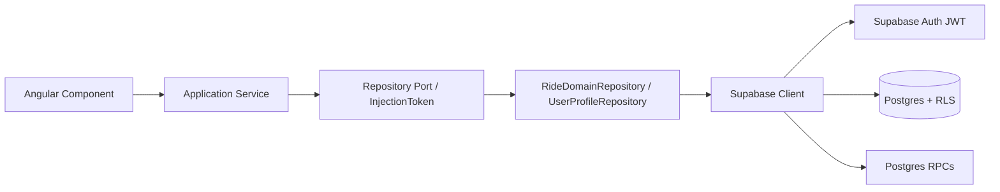
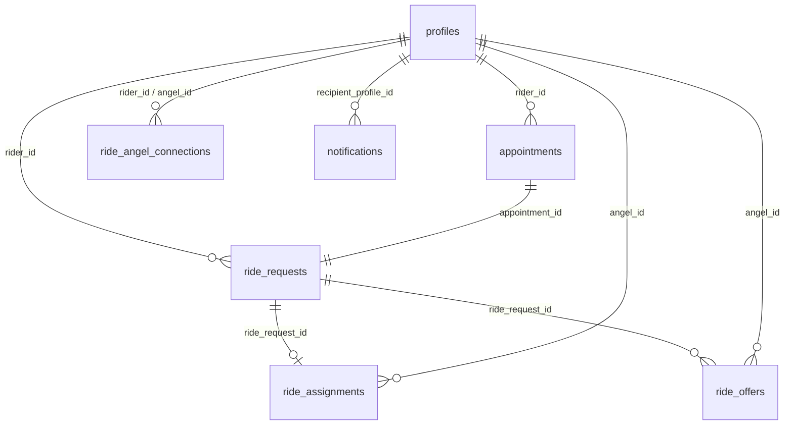

# Backend architecture (V1)

Ride Angels V1 uses **Supabase** as the hosted backend: Auth, Postgres, Row Level Security (RLS), and Postgres RPCs. There is **no custom REST API** and **no Edge Functions** for V1. Transactional logic that must be atomic lives in `SECURITY DEFINER` Postgres functions.

Stack: **Ionic Angular 20 + Capacitor 8 + Supabase Auth/Postgres/RLS**.

---

## V1 request flow



### Layer responsibilities

| Layer | Role |
|-------|------|
| **Component** | Presentation, form validation, navigation |
| **Application service** | Domain orchestration (`AppointmentService`, `RideOfferService`, `RideAngelService`, `NotificationService`, `AuthService`) |
| **Repository port** | Swap-point interface (`UserProfileRepositoryPort`, `AppointmentRepositoryPort`, …) defined in `src/app/core/repositories/contracts.ts` |
| **Supabase repository** | Maps app models ↔ Postgres tables/RPCs (`RideDomainRepository`, `UserProfileRepository`) |
| **Supabase client** | Public anon key + user JWT only (`src/app/core/supabase/supabase-client.ts`) |

Presentation code should call **services**, not Supabase directly. Repository ports (`src/app/core/repositories/tokens.ts`) and Supabase adapters (`src/app/core/repositories/supabase-adapters.ts`) exist so a future custom API can replace the Supabase implementation without rewriting UI flows.

After sign-in, `DomainSyncService` loads visible domain rows from Supabase and hydrates in-memory service caches. Core correctness must work after a full refresh — realtime is an enhancement, not a requirement.

---

## Why Supabase (V1)

- **Passwordless OTP** (phone primary, email secondary) without building auth infrastructure
- **Postgres + RLS** enforces authorization at the database, not only in the Ionic app
- **RPCs** provide atomic multi-table writes (create appointment + ride, claim, accept offer) without a separate API server
- **Direct client access** fits a mobile-first product with a small team; fewer moving parts than a custom backend for V1
- **Future migration path**: swap repository implementations behind the same ports if a custom API is added later

---

## Auth separation

Three distinct concepts — never conflate them:

| Concept | Source of truth | Notes |
|---------|-----------------|-------|
| **Supabase Auth user** | `auth.users.id` (UUID) | Created by OTP verify; owns JWT |
| **Auth methods** | Verified phone / email on Auth user | Twilio/Resend configured in Supabase Dashboard only |
| **Ride Angels profile** | `public.profiles` | `id = auth_user_id = auth.users.id`; **never** keyed by email or phone |

On Auth user insert, `handle_new_auth_user()` trigger creates an empty profile row. The app loads profiles via `getByAuthUserId(user.id)` only.

See also: [authentication.md](./authentication.md).

---

## Database tables (V1)

| Table | Purpose |
|-------|---------|
| `profiles` | Application profile; `roles text[]` for personal rider/rideAngel capabilities |
| `appointments` | Scheduled event (title, `ride_date`, `ride_time`) owned by `rider_id` |
| `ride_requests` | Transportation need linked 1:1 to an appointment; flattened addresses |
| `ride_offers` | Angel offers on **public** rides |
| `ride_assignments` | Confirmed driver (`angel_id`) for a ride (unique per ride) |
| `ride_angel_connections` | Personal trusted circle between rider and angel |
| `notifications` | In-app notifications for the recipient profile |

Addresses are **denormalized** on `ride_requests`: `pickup_label`, `pickup_line1`, `destination_label`, `destination_line1`. There is no normalized address table in V1.

See [database-schema.md](./database-schema.md) for full field lists, constraints, and ER diagram.

---

## Relationships (summary)



- `rider_id`, `angel_id`, and profile `id` all reference `profiles.id` (= `auth.users.id`)
- `ride_assignments.ride_request_id` is **unique** (one assignment per ride)
- `ride_angel_connections` has `unique (rider_id, angel_id)`

---

## Capabilities: `profiles.roles` (intentional V1 choice)

Personal capabilities are stored as `profiles.roles text[]` with values like `'rider'` and `'rideAngel'`. There is **no** separate `user_capabilities` table in V1.

Organization memberships remain a separate future concept (`OrganizationMembership` in app models; `organizationsEnabled: false`). Do not merge org RBAC into `profiles.roles`.

Frontend checks via `AuthorizationService.hasPersonalCapability(...)` are **UX only**; backend enforcement for ride visibility uses RLS and RPC validation.

---

## Row Level Security (RLS)

RLS is enabled on all public domain tables. Policies use `auth.uid()` compared to profile/rider/angel IDs (which equal `auth.users.id`).

### Profiles

| Policy | Access |
|--------|--------|
| `profiles_select_own` | User reads/writes own row |
| `profiles_select_related` | Read profiles in trusted circle (`pending`/`accepted`) or public-board riders with open public rides |

No client-side profile delete policy. Account deletion uses the `delete_own_account` RPC (security definer), which deletes `auth.users` and cascades domain data.

### Appointments & ride requests

- **Rider** always sees own rows
- **Public rides** (`visibility = 'public'`) visible to authenticated users (board discovery)
- **Private rides** visible to rider and **accepted** trusted angels (`ride_angel_connections.status = 'accepted'`)
- **Assigned Ride Angels** always retain SELECT on their confirmed ride/appointment (and rider profile), even if the rider later turns off community-board visibility

Visibility controls **discovery** only. Switching public→private after assignment must not revoke the assigned driver's access. To change drivers, use cancel assignment / cancel ride.

### Offers & assignments

- Angels see their own offers/assignments
- Riders see offers/assignments on their rides
- Offer insert blocked when `angel_id = rider_id` (cannot offer on own ride)

### Connections

- Visible to `rider_id` or `angel_id`
- Insert: rider invites angel (`rider_id = auth.uid()`, `angel_id <> auth.uid()`)
- Self-connection prevented by check constraint

### Notifications

- Select/update own rows (`recipient_profile_id = auth.uid()`)
- **Insert denied** for clients — only RPCs insert notifications

---

## Public vs private authorization

| Visibility | Who can see the ride | How it gets claimed |
|------------|----------------------|---------------------|
| `private` | Rider + **accepted** trusted angels | `claim_private_ride` RPC (trusted angel only) |
| `public` | Any authenticated user | `submit_ride_offer` → rider calls `accept_ride_offer` |
| `none` | Rider only (draft/hidden) | Not claimable via board |

**Trusted circle:** `ride_angel_connections.status = 'accepted'` means an **active, trusted** angel relationship. `pending` allows profile visibility for invites; `declined` and `removed` end trust.

Connection statuses: `pending`, `accepted`, `declined`, `removed`.

---

## Transactional operations (Postgres RPCs)

All RPCs are `SECURITY DEFINER`, `search_path = public`, granted to `authenticated` only.

| RPC | Purpose |
|-----|---------|
| `create_appointment_with_ride(payload jsonb)` | Atomic insert of appointment + ride; sets status `private_requested` or `public_requested` |
| `claim_private_ride(p_ride_request_id)` | Trusted angel claims private ride → assignment + `ride_confirmed` + notification |
| `submit_ride_offer(p_ride_request_id, p_message?)` | Angel submits public offer → `offers_received` + notification |
| `accept_ride_offer(p_ride_request_id, p_ride_offer_id)` | Rider accepts one offer → assignment, closes other pending offers, notification |
| `find_profile_for_invite(identifier text)` | Lookup onboarded profile by exact email (case-insensitive) or E.164 phone |

### Helper functions

| Function | Purpose |
|----------|---------|
| `current_profile_id()` | Returns `auth.uid()` |
| `is_active_private_angel(rider_id, angel_id?)` | True when connection status is `accepted` |
| `is_ride_owner(ride_request_id)` | True when `ride_requests.rider_id = auth.uid()` |
| `set_updated_at()` | Trigger helper for `updated_at` columns |

Ride status values (DB-enforced): `draft`, `ride_needed`, `private_requested`, `public_requested`, `offers_received`, `ride_confirmed`, `upcoming`, `in_progress`, `completed`, `cancelled`, `ride_cancelled`.

Offer status values: `pending`, `accepted`, `declined`, `withdrawn`, `closed`.

The Ionic app calls these via `RideDomainRepository` → `getSupabaseClient().rpc(...)`.

---

## Storage (avatars)

V1 ships migration `20260811000003_avatars_storage.sql`: public **`avatars`** bucket with object paths `{authUserId}/avatar.*`. The `profiles.avatar_url` column stores the public URL after upload.

**Note:** A storage bucket migration may not yet exist in `supabase/migrations/`. Configure the bucket and RLS policies in the Supabase Dashboard (or add a future migration) before enabling avatar upload in production. Never expose the `service_role` key in the Ionic app — uploads use the authenticated user's JWT with bucket policies scoped to their folder.

---

## Realtime

V1 core flows use **fetch on refresh** (`DomainSyncService.refreshForCurrentUser()`). Selective Supabase Realtime subscriptions for `notifications` and `ride_offers` are planned but not required for correctness. If added, subscribe only to tables/policies the user can already read via RLS.

---

## Edge Functions

**None for V1.** All transactional logic is Postgres RPC. Do not add Edge Functions for ride claim/offer flows unless there is a clear requirement Postgres cannot satisfy.

---

## Twilio (SMS OTP)

Phone OTP is configured in **Supabase Dashboard → Authentication → Providers → Phone** using **Twilio Verify**.

- The Ionic app never embeds Twilio credentials
- SMS is sent by Supabase Auth during `signInWithOtp` / `verifyOtp`
- Prefer **Twilio Verify** (Verify Service SID `VA…`). US toll-free Messaging
  verification is not required for Verify OTP; previous TFN path was rejected — see [phone-otp.md](./phone-otp.md)
- Runbook: [phone-otp.md](./phone-otp.md) · setup overview: [supabase-setup.md](./supabase-setup.md)

---

## Resend (email OTP)

Email OTP / magic link delivery is configured in **Supabase Dashboard → Authentication → SMTP Settings** (Resend or another SMTP provider).

- Use OTP-style email templates with `{{ .Token }}`
- The Ionic app never embeds Resend API keys
- Secondary sign-in method after phone

---

## Organization compatibility

V1 is **individual-first**. Optional `coordinating_organization_id` fields exist on app models for future use but are **not** in the current Postgres schema. Feature flag: `environment.organizationsEnabled` (`false`).

When organizations ship, expect additive columns and RLS — not a rewrite of rider/angel core tables. See [organization-readiness.md](./organization-readiness.md).

---

## Custom API migration path

The app is structured to swap backends without UI rewrites:

1. **Ports** — `src/app/core/repositories/contracts.ts` + `tokens.ts`
2. **Current impl** — `RideDomainRepository`, `UserProfileRepository`, `supabase-adapters.ts`
3. **Services** — `AppointmentService`, `RideOfferService`, etc. keep stable method names
4. **Future impl** — New repository classes calling REST/GraphQL; register via Angular `providers` on the same tokens

Auth can remain on Supabase even if domain data moves to a custom API. Environment stays `environment.supabase.url` + `anonKey` for V1; a future API would add separate config keys.

---

## Environment & security

```ts
// src/environments/environment*.ts
supabase: {
  url: 'https://<project-ref>.supabase.co',
  anonKey: '<anon-or-publishable-key>',
}
```

- **Never** put `service_role` in the Ionic app
- Leave `url` / `anonKey` empty for local OTP mock development
- Frontend role/capability checks are UX only; RLS + RPCs enforce access

---

## Migrations (apply in order)

1. `supabase/migrations/20260811000000_profiles.sql`
2. `supabase/migrations/20260811000001_rides_domain.sql`
3. `supabase/migrations/20260811000002_v1_hardening.sql`

Setup details: [supabase-setup.md](./supabase-setup.md).

---

## Related docs & code

| Doc / path | Topic |
|------------|-------|
| [database-schema.md](./database-schema.md) | Tables, constraints, indexes, ER diagram |
| [supabase-setup.md](./supabase-setup.md) | Dashboard setup, Twilio, Resend, storage |
| [authentication.md](./authentication.md) | OTP flows, profile ownership |
| [organization-readiness.md](./organization-readiness.md) | Future org layer |
| `src/app/core/services/ride-domain.repository.ts` | Supabase table/RPC mapping |
| `src/app/core/services/user-profile.repository.ts` | Profile CRUD |
| `supabase/migrations/*.sql` | Source of truth for schema |

**Status:** Schema and RPCs are defined in-repo; end-to-end production readiness requires applying migrations, configuring Auth providers, and testing multi-account flows on a live project.
