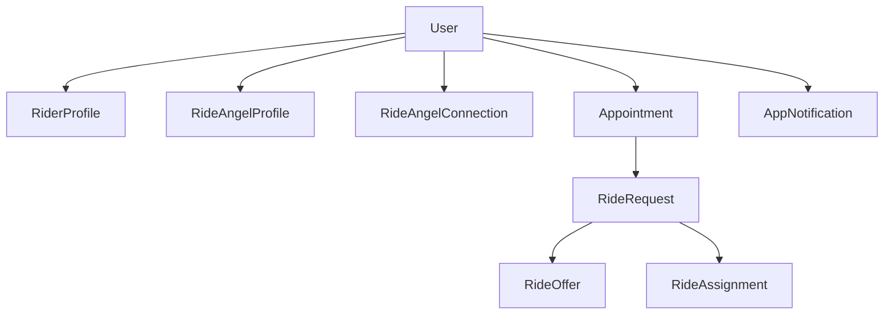
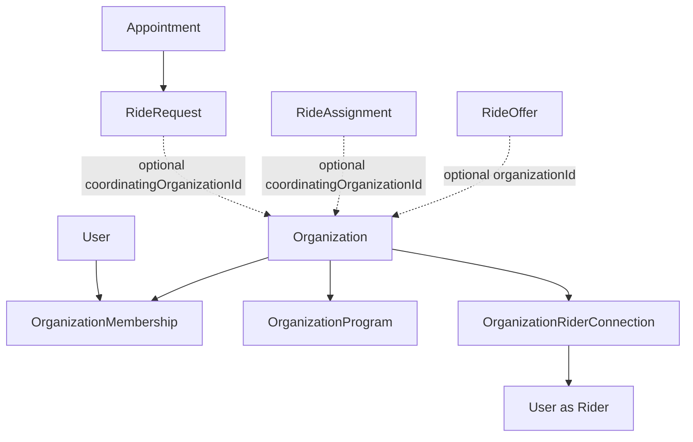

# Organization readiness

Ride Angels today is an **individual-first** Rider ↔ Ride Angel coordination app.
This document describes how the codebase is prepared for a future **paid organization layer** without requiring a rewrite of the consumer product.

Organizations (hospitals, churches, nonprofits, senior communities, municipalities, volunteer programs, etc.) are an **additive coordination layer**, not the center of the domain.

---

## Current architecture

### First-class consumer concepts

| Concept | Ownership |
|--------|-----------|
| **User** | Global identity; may hold multiple personal roles |
| **Appointment** | Owned by `riderId` |
| **RideRequest** | Rider transportation need; optional future org coordination |
| **RideOffer** | Angel → rider offer on public/community boards |
| **RideAssignment** | Confirmed rider ↔ angel transportation arrangement |
| **RideAngelConnection** | Personal trusted circle (not org membership) |

### Personal roles vs organization roles

- **Personal:** `User.roles` / `PersonalCapability` (`act_as_rider`, `act_as_ride_angel`)
- **Organization:** `OrganizationMembership.role` (`owner`, `admin`, `coordinator`, `staff`, `volunteer`, `viewer`)
- A user may be a Rider personally, a volunteer in Org A, and a coordinator in Org B.

Legacy note: prefer `roles: ['rider','rideAngel']` over `'both'`.

---

## Organization extension points

Domain types live in `src/app/core/models/organization.ts` and are re-exported from `src/app/core/models/index.ts`.

| Future concept | Status now |
|----------------|------------|
| `Organization` | Interface only; catalog empty |
| `OrganizationMembership` | Interface + permission baseline map |
| `OrganizationRiderConnection` | Interface (consent-based rider link) |
| `OrganizationProgram` | Interface reserved |
| `OrganizationInvitation` | Interface reserved |
| `OrganizationSettings` | Interface reserved |
| `OrganizationSubscription` / billing | Interface reserved — **not on User** |
| `OrganizationSponsor` | Interface reserved |
| `OrganizationAuditEvent` | Interface reserved |

### Optional organization context

`OrganizationContextService`:

- Default: **no active organization** (`activeOrganizationId === null`)
- Must never be required for Rider / Ride Angel core flows
- Explicit `setActiveOrganization(id | null)` for future multi-context UI

Feature flag: `environment.organizationsEnabled` (currently `false`).

Placeholder feature area: `src/app/features/organizations/` (README only — no routes/UI).

---

## Intended relationships

### Ownership vs creation vs coordination

These are intentionally separate:

| Field | Meaning |
|-------|---------|
| `riderId` | Who needs the ride (owner of the need) |
| `createdByUserId` | Who created the record (may be a coordinator later) |
| `coordinatingOrganizationId` | Who is helping coordinate (optional) |
| `angelId` / assignment | Who is driving |

Do **not** assume `createdByUserId === riderId` forever. Today they match for consumer creates.

---

## Visibility

Current UI uses:

- `private` — trusted personal circle
- `public` — community board

Reserved (typed, unused in UI):

- `organization`
- `organization_program`

Personal claim-board logic continues to ignore reserved values.

---

## Permissions boundary

Use `AuthorizationService`:

- `hasPersonalCapability(...)`
- `hasOrganizationPermission(...)`
- `canCoordinateRider(organizationId, riderUserId)`

Rules:

- Do **not** scatter `role === 'admin'` checks in components
- Membership alone does **not** grant unrestricted rider data access
- Rider coordination requires `OrganizationRiderConnection` consent
- Frontend checks are UX only; backend must enforce later

---

## Subscription / monetization boundary

Future billing attaches to **organizations**, not individual Users:

- `OrganizationSubscription`
- `OrganizationBillingAccount`
- Future `OrganizationEntitlementService` (not implemented)

Individuals keep using core Rider / Ride Angel flows without a plan check.

Do not put `plan === 'ENTERPRISE'` conditionals in UI.

---

## Multi-tenancy considerations

- `organizationId` is **never** a global application assumption
- Existing records remain valid with no organization fields
- Future org queries must be scoped explicitly by `organizationId`
- Avoid requiring a global `currentOrganization` for the consumer app to boot

---

## Repository / service boundaries

Swap-point interfaces: `src/app/core/repositories/index.ts`

Current UI continues to call domain services (`AppointmentService`, `RideOfferService`, `RideAngelService`, etc.). Those services are the in-memory repositories today and can later delegate to REST/GraphQL/Supabase/etc.

`MockOrganizationRepository` implements `OrganizationRepository` against the empty catalog.

Meaningful operations stay centralized in services (`createAppointment`, `inviteByEmail`, `acceptOffer`, `confirmPrivateClaim`, …) so notifications, analytics, and audit can hook later without UI rewrites.

---

## Verification (future)

Do not treat `RideAngelProfile.verified` as organization approval.

Future verification may be:

- global identity verification
- org-specific volunteer approval
- program-specific approval

---

## Reporting (future)

Timestamps and status transitions already support later reporting:

- rides requested / confirmed / cancelled
- offer lifecycle
- assignment `assignedAt`
- connection invite / accept times

No analytics UI is implemented.

---

## Privacy

Sensitive fields (addresses, appointments, phones) must remain purpose-scoped.

Organization association ≠ automatic access to all rider data.

---

## What intentionally is NOT implemented

- Organization UI, tabs, selectors, dashboards
- Admin settings / RBAC product surfaces
- Subscriptions, payments, invoices, entitlements enforcement
- Sponsorship workflows
- Programs product
- Audit log persistence
- Tenant isolation middleware
- Backend authorization enforcement
- Org-scoped visibility in the Figma consumer UI

---

## Additive fields already present on consumer models

| Model | Additive optional fields |
|-------|--------------------------|
| `Appointment` | `createdByUserId`, `coordinatingOrganizationId`, `updatedByUserId` |
| `RideRequest` | `createdByUserId`, `source`, `coordinatingOrganizationId`, `programId` |
| `RideOffer` | `organizationId` |
| `RideAssignment` | `assignedByUserId`, `coordinatingOrganizationId` |
| `AppNotification` | `relatedOrganizationId` |
| `RideVisibility` | reserved `organization`, `organization_program` |

Mock data and create paths remain valid **without** organization IDs.

---

## Related code

- Models: `src/app/core/models/index.ts`, `src/app/core/models/organization.ts`
- Context: `src/app/core/services/organization-context.service.ts`
- AuthZ: `src/app/core/services/authorization.service.ts`
- Personal capability helper: `src/app/core/utils/personal-capability.ts`
- Repositories: `src/app/core/repositories/`
- Flag: `src/environments/environment*.ts` → `organizationsEnabled`
- Feature placeholder: `src/app/features/organizations/README.md`
